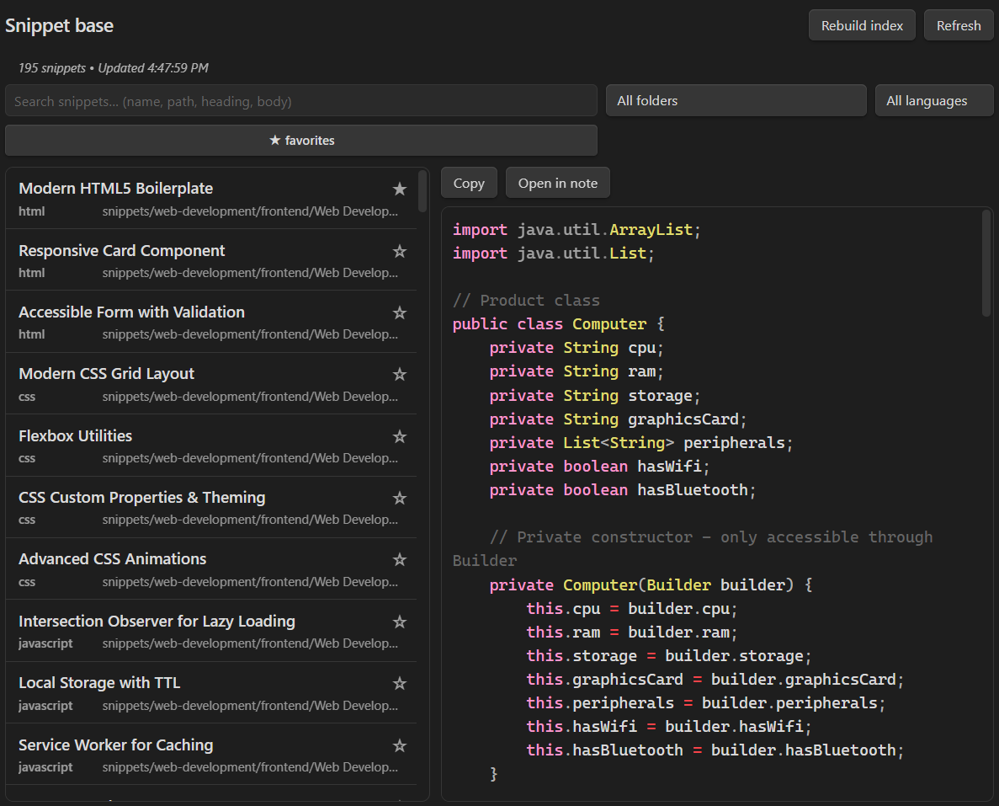
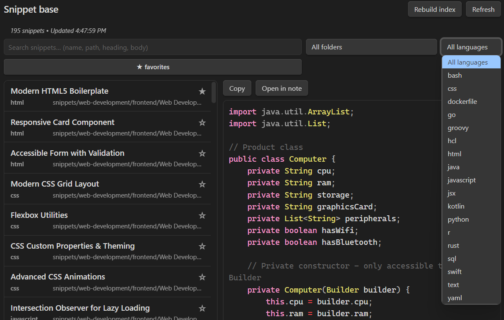

# SnippetBase

A vault-wide database UI for fenced code snippets in Obsidian. Build and maintain a personal code library directly in your notes.

Search, filter, and copy code snippets instantly - perfect for developers who collect code examples, configurations, and reusable patterns across their knowledge base.

**What you can do in 10 seconds:**
- Open SnippetBase from the ribbon or command palette
- See all your fenced code snippets in one searchable list
- Filter by language, folder, or mark favorites
- Preview syntax-highlighted code and copy to clipboard

## Features

- **Search & Filter**: Find snippets by content, language, or folder
- **Live Preview**: Syntax-highlighted code preview with copy functionality
- **Favorites**: Mark and filter favorite snippets
- **Incremental Indexing**: Automatically updates when you modify markdown files
- **Multiple Views**: Open in tab or right sidebar
- **Fast Performance**: Optimized for large vaults with hundreds of snippets

## How it works

SnippetBase automatically indexes all fenced code blocks from your markdown files and maintains a searchable database. When you modify, rename, or delete notes, the index updates incrementally to stay current.

All data is stored locally in your vault under `.obsidian/plugins/snippetbase/` - nothing is sent to external servers.

## Known limitations

- Search uses substring matching (not fuzzy search)
- Preview truncates snippets longer than 200 lines
- Code fences without language tags are treated as plain text
- Desktop-only (not available on mobile)

## Installation

### Install via Community Plugins (once listed)

1. Open **Settings → Community plugins**
2. Browse and install "SnippetBase"
3. Enable the plugin

### Manual install from Releases (current)

1. Download the latest release from [GitHub Releases](https://github.com/brielms/SnippetBase/releases)
2. Extract the files to your vault's `.obsidian/plugins/snippetbase/` folder
3. Reload Obsidian and enable "SnippetBase" in **Settings → Community plugins**

## Usage

### Opening SnippetBase
- **Ribbon Icon**: Click the code icon in the left sidebar
- **Command Palette**: Search for "SnippetBase: Open"
- **Commands**:
  - `Open in new tab` - Opens in a new tab
  - `Open in right sidebar` - Opens in right sidebar

### Features
- **Search**: Type in the search box to filter snippets by content
- **Language Filter**: Filter by programming language (JavaScript, Python, etc.)
- **Folder Filter**: Filter by vault folder location
- **Favorites**: Click the star icon to favorite/unfavorite snippets
- **Copy**: Click the copy button to copy snippet content to clipboard
- **Preview**: Click any snippet to see full syntax-highlighted preview

## Screenshots

*Main interface with snippet list and syntax-highlighted preview*


*Filter controls and search functionality*


### Commands
- `SnippetBase: Rebuild snippet index` - Manually rebuild the snippet database

## Privacy

SnippetBase is designed with privacy as a core principle:

- **No network required**: Works completely offline - no internet connection needed
- **No telemetry or data collection**: Nothing is sent to external servers
- **Local storage only**: All data stays in your vault's `.obsidian/plugins/snippetbase/` folder
- **No external dependencies**: Uses only built-in Obsidian APIs

## FAQ

**Can it paste into my terminal automatically?**  
No, SnippetBase copies to your clipboard for manual pasting. This gives you control over where and how you use the code.

**Does it edit my notes?**  
No, SnippetBase only reads your markdown files to index code snippets - it never modifies your notes.

**Where is data stored?**  
Everything is stored locally in your vault under `.obsidian/plugins/snippetbase/`.

## Changelog

### 0.1.0
- Initial release with core functionality
- Search and filter snippets by content, language, and folder
- Live syntax-highlighted preview
- Favorites system
- Incremental indexing on file changes
- Copy snippets to clipboard
- Multiple view modes (tab/sidebar)

## Development

This plugin is built with TypeScript and uses the Obsidian Plugin API.

### Setup
```bash
npm install
npm run dev  # Watch mode
npm run build  # Production build
```

### Architecture
- `src/main.ts` - Plugin lifecycle and event handling
- `src/snippetBase/indexer.ts` - Snippet parsing and indexing
- `src/ui/SnippetBaseView.ts` - Main UI component
- `src/settings.ts` - Settings and configuration

## Support

For maintainers: see [RELEASING.md](RELEASING.md) for release instructions.

If you find this plugin useful, consider:
- Starring the repository on GitHub
- Contributing improvements via pull requests
- [Buying me a coffee](https://buymeacoffee.com/brielms) if you'd like to support development

## License

MIT License - see LICENSE file for details
